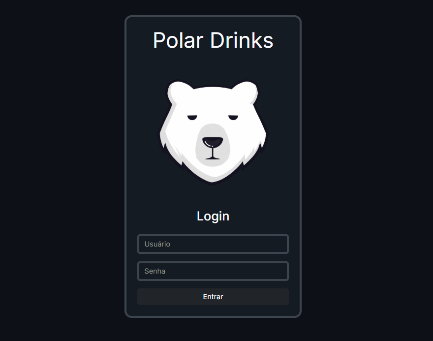
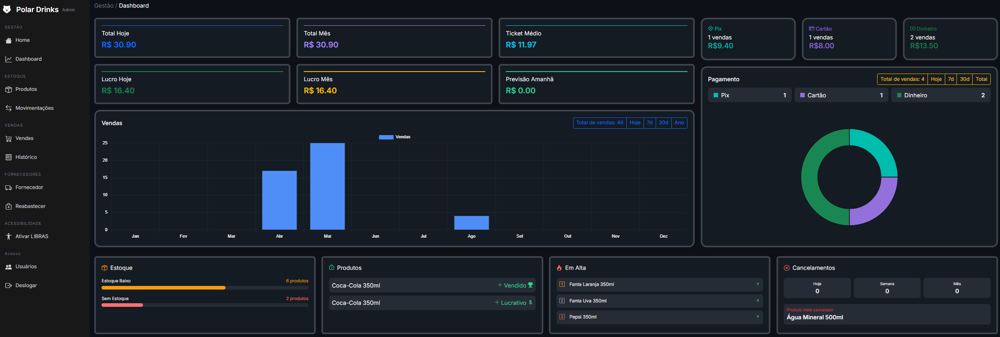
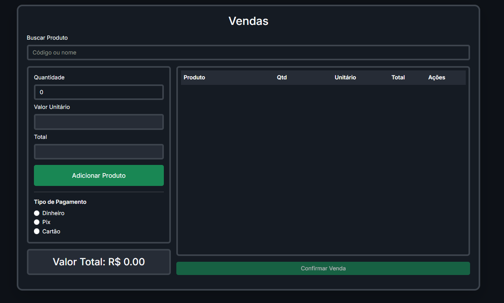
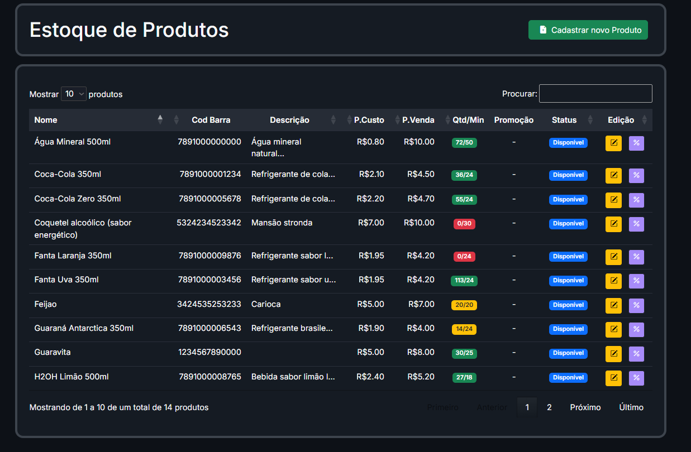
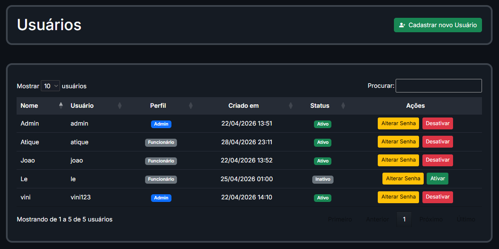
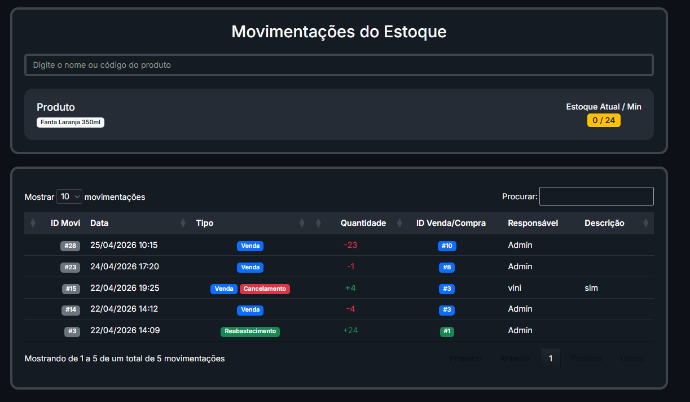

# Polar Drinks
<div align="center">
👨‍💻 Desenvolvido por

**[Kishin](https://github.com/kishinbr)**

</div>

---

<div align="center">



# 🥤 Polar Drinks — Sistema de PDV (Ponto de Venda)

**Sistema de PDV completo para gerenciar vendas de bebidas de forma rápida e prática.**
Registre vendas, controle produtos e estoque, acompanhe clientes e gere relatórios — tudo em um só lugar.


</div>

---

## ✨ Funcionalidades

| Módulo | Descrição |
|--------|-----------|
| 🔐 **Login** | Autenticação segura de acesso ao sistema |
| 📊 **Dashboard** | Visão geral de vendas, faturamento e movimentação |
| 🛒 **Vendas (PDV)** | Registro rápido de vendas no ponto de venda |
| 🥤 **Produtos** | Catálogo de bebidas com código, preço e estoque |
| 📦 **Estoque** | Controle de entrada e saída de produtos |
| 👥 **Usuários** | Cadastro e edição de usuários |
| 📄 **Movimentações** | Geração de relatórios de vendas e movimentações |


---

## 🖥️ Telas do Sistema


### 🔑 Login


---

### 📊 Dashboard


---

### 🛒 Ponto de Venda (PDV)


---

### 🥤 Produtos


---

### 👥 Usuários


---

### 📄 Movimentações


---

## 🏗️ Arquitetura do Projeto

```
PolarDrinks/
├── Controllers/          # Controllers (Vendas, Produtos, Clientes, Estoque, Login)
├── Data/
│   ├── ApplicationDbContext.cs   # Contexto do Entity Framework
│   └── DbInitializer.cs          # Seed automático de dados iniciais
├── Migrations/           # Migrations do Entity Framework Core
├── Models/                # Entidades do banco de dados
├── Repositories/          # Padrão Repository (acesso ao banco)
├── Services/              # Lógica de negócio
├── Views/                 # Views (frontend)
└── wwwroot/                # Arquivos estáticos (CSS, JS, imagens)
```


---

## 🚀 Como Rodar Localmente

### Pré-requisitos

- [.NET SDK](https://dotnet.microsoft.com/download)
- [SQL Server](https://www.microsoft.com/pt-br/sql-server/sql-server-downloads) (ou SQL Server Express)
- [Git](https://git-scm.com/)

---

### 1. Clonar o Repositório

```bash
git clone https://github.com/kishinbr/PDV---Polar-Drinks.git
cd PDV---Polar-Drinks
```

---

### 2. Configurar a Connection String

Abra o arquivo `appsettings.json` e altere a connection string para o seu banco de dados local:

```json
"ConnectionStrings": {
  "DefaultConnection": "Server=SEU_SERVIDOR; Database=PolarDrinksDB; Trusted_Connection=True; TrustServerCertificate=True;"
}
```

> 💡 Se estiver usando SQL Server local com Windows Authentication, basta substituir `SEU_SERVIDOR` pelo nome da sua instância (ex: `localhost` ou `DESKTOP-XXXX`).

---

### 3. Restaurar Dependências

```bash
dotnet restore
```

---

### 4. Rodar o Projeto

```bash
dotnet run
```

Acesse: **http://localhost:5000**

> ⚠️ Confirme a porta correta que aparece no terminal ao rodar o projeto.

---

### 5. Login Padrão

```
Usuário: admin
Senha:   admin123
```


---

## 📦 Dependências Principais

| Pacote | Versão | Uso |
|--------|--------|-----|
| `Microsoft.EntityFrameworkCore.SqlServer` | - | ORM para SQL Server |
| `Microsoft.EntityFrameworkCore.Tools` | - | Migrations e CLI |
| `Bootstrap` | 5 | Interface responsiva |


---

## ☁️ Deploy (Hospedagem)

Para hospedar em produção:

```bash
dotnet publish -c Release -o ./publish
```

Compacte a pasta `publish/` e faça o upload no seu servidor (ex: Somee.com, Azure App Service, etc.).

---

## 👨‍💻 Desenvolvido por

<div align="center">

**[Kishin](https://github.com/kishinbr)**

</div>

---


